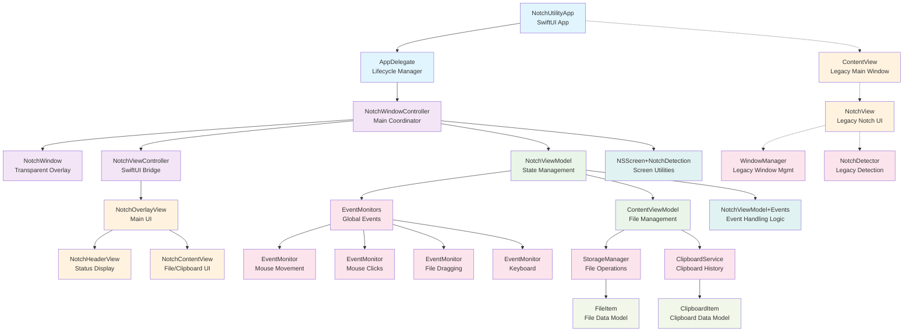

# NotchUtility Architecture Design

A comprehensive overview of the NotchUtility application architecture, component relationships, and data flow patterns.

## 🏗️ High-Level Architecture

NotchUtility follows a layered MVVM architecture with reactive state management, designed specifically for creating a seamless notch overlay interface on macOS. The architecture prioritizes:

- **Reactive UI Updates**: Using Combine for state synchronization
- **Global Event Handling**: System-wide mouse and keyboard monitoring
- **Clean Separation**: Clear boundaries between UI, business logic, and system integration
- **Performance**: Minimal resource usage for background operation

## 📊 System Architecture Diagram



## 🏛️ Architectural Layers

### 1. Application Layer
**Responsibilities**: App lifecycle, initialization, and top-level coordination

#### `NotchUtilityApp`
- **Type**: SwiftUI App entry point
- **Role**: Minimal SwiftUI app shell that delegates to AppDelegate
- **Key Feature**: Uses `@NSApplicationDelegateAdaptor` to hand control to AppDelegate

#### `AppDelegate`
- **Type**: NSApplicationDelegate
- **Role**: Application lifecycle manager and notch system coordinator
- **Key Responsibilities**:
  - Configure app as accessory (no dock icon)
  - Monitor display configuration changes
  - Initialize global event system
  - Create and manage NotchWindowController instances
  - Handle app-wide maintenance and cleanup

### 2. Window Management Layer
**Responsibilities**: Window creation, positioning, and lifecycle management

#### `NotchWindowController`
- **Type**: NSWindowController (Main Coordinator)
- **Role**: The "brain" that coordinates window, screen detection, and view model
- **Key Responsibilities**:
  - Create transparent overlay windows
  - Detect physical notch dimensions and position
  - Set up coordinate system for notch interactions
  - Manage SwiftUI view hierarchy integration
  - Bridge between AppKit and SwiftUI

#### `NotchWindow`
- **Type**: NSWindow (Specialized)
- **Role**: Transparent overlay window for notch area
- **Key Features**:
  - Full-screen transparent background
  - High window level (above menu bar)
  - Non-movable to prevent displacement
  - Compatible with full-screen apps and multiple spaces

#### `NotchViewController`
- **Type**: NSHostingController
- **Role**: Bridge between NSWindow and SwiftUI
- **Purpose**: Embeds SwiftUI NotchOverlayView into AppKit window system

### 3. View Model Layer
**Responsibilities**: State management, business logic, and data coordination

#### `NotchViewModel`
- **Type**: ObservableObject (@MainActor)
- **Role**: Central state management for notch interface behavior
- **Key Responsibilities**:
  - Manage interface states (closed/opened/popping)
  - Coordinate global event monitoring
  - Handle geometry calculations
  - Provide animation configuration
  - Bridge to file management system
- **State Management**:
  ```swift
  enum Status { case closed, opened, popping }
  enum OpenReason { case click, hover, drag, boot, unknown }
  ```

#### `ContentViewModel`
- **Type**: ObservableObject (@MainActor)
- **Role**: File and clipboard management state
- **Key Responsibilities**:
  - Handle file drop operations
  - Manage storage operations
  - Coordinate clipboard history
  - Provide computed properties for UI
  - Error handling and user feedback

### 4. View Layer
**Responsibilities**: User interface components and user interaction

#### `NotchOverlayView`
- **Type**: SwiftUI View (Main UI)
- **Role**: Primary notch interface
- **Features**:
  - Dynamic sizing based on state
  - Complex masking for notch shape
  - Drag detection and file drop handling
  - Smooth state transitions

#### `NotchHeaderView`
- **Type**: SwiftUI View
- **Role**: Status display in expanded interface
- **Content**: App name, storage usage, file count

#### `NotchContentView`
- **Type**: SwiftUI View
- **Role**: Main content area with tabs
- **Features**:
  - Tab-based interface (Files/Clipboard)
  - File grid with quick actions
  - Clipboard history display
  - Drop zone integration

### 5. Services Layer
**Responsibilities**: System integration, data persistence, and external communication

#### `EventMonitors` (Singleton)
- **Type**: Global Event Coordinator
- **Role**: Central nervous system for global event monitoring
- **Capabilities**:
  - Track mouse position globally
  - Detect clicks anywhere on screen
  - Monitor file dragging operations
  - Watch modifier keys
- **Publishers**:
  ```swift
  let mouseLocation: CurrentValueSubject<NSPoint, Never>
  let mouseDown: PassthroughSubject<Void, Never>
  let mouseDraggingFile: PassthroughSubject<Void, Never>
  let optionKeyPressed: CurrentValueSubject<Bool, Never>
  ```

#### `EventMonitor`
- **Type**: NSEvent Monitor Wrapper
- **Role**: Simplifies global system event monitoring
- **Purpose**: Clean lifecycle management for NSEvent monitors

#### `StorageManager`
- **Type**: ObservableObject
- **Role**: File storage operations and lifecycle management
- **Features**:
  - Temporary file storage (100MB limit, 24-hour retention)
  - File metadata tracking
  - Automatic cleanup mechanisms
  - Thumbnail generation
  - File validation and integrity checks

#### `ClipboardService`
- **Type**: ObservableObject (@MainActor)
- **Role**: Clipboard history management
- **Features**:
  - Monitor clipboard changes
  - Maintain history (5 items max)
  - Type detection (text, image, URL, other)
  - Copy operations

### 6. Models Layer
**Responsibilities**: Data structures and business entities

#### `FileItem`
- **Type**: Struct (Identifiable, Codable)
- **Role**: File data model
- **Properties**: id, name, path, type, size, dateAdded, contentHash
- **Features**: Thumbnail generation, formatted size display

#### `ClipboardItem`
- **Type**: Struct (Identifiable, Codable)
- **Role**: Clipboard entry data model
- **Properties**: id, content, type, dateAdded, changeCount
- **Features**: Content truncation, formatted date display

### 7. Extensions Layer
**Responsibilities**: System integration utilities and extensions

#### `NSScreen+NotchDetection`
- **Type**: NSScreen Extension
- **Role**: Advanced notch detection and measurement
- **Capabilities**:
  - Calculate precise notch dimensions
  - Identify built-in vs external displays
  - Handle different MacBook models
  - Provide fallbacks for non-notch Macs

#### `NotchViewModel+Events`
- **Type**: NotchViewModel Extension
- **Role**: Event handling logic
- **Responsibilities**:
  - Set up Combine subscriptions
  - Handle hover/click/drag behaviors
  - Manage haptic feedback
  - Control interface visibility

## 🔄 Data Flow Patterns

### 1. Event Flow
```
System Event → EventMonitor → EventMonitors → NotchViewModel → UI Update
```

### 2. File Drop Flow
```
File Drop → NotchOverlayView → ContentViewModel → StorageManager → UI Update
```

### 3. State Change Flow
```
User Interaction → NotchViewModel → Published Property → SwiftUI View Update
```

### 4. Clipboard Flow
```
Clipboard Change → ClipboardService → ContentViewModel → UI Update
```

## 🏗️ Key Architectural Decisions

### 1. **MVVM with Combine**
- **Rationale**: Reactive state management for complex UI states
- **Benefit**: Automatic UI updates, clean separation of concerns
- **Implementation**: @Published properties trigger view updates

### 2. **Global Event Monitoring**
- **Rationale**: Notch interface needs to respond to system-wide events
- **Challenge**: Events occur outside our app's windows
- **Solution**: NSEvent global monitors with Combine publishers

### 3. **Transparent Overlay Window**
- **Rationale**: Seamless integration with desktop
- **Implementation**: Full-screen transparent NSWindow at high level
- **Benefit**: Appears to be part of the system, not a separate app

### 4. **Dual Architecture (New + Legacy)**
- **Current State**: New overlay system alongside legacy components
- **Rationale**: Incremental migration while maintaining functionality
- **Future**: Legacy components will be phased out

### 5. **@MainActor for UI Components**
- **Rationale**: Ensure all UI updates happen on main thread
- **Benefit**: Thread safety for SwiftUI components
- **Implementation**: ViewModels and Services marked with @MainActor

### 6. **Singleton for Event System**
- **Rationale**: Need exactly one global event monitoring system
- **Benefit**: Centralized event coordination, resource efficiency
- **Implementation**: EventMonitors.shared

## 🚀 Performance Considerations

### 1. **Memory Management**
- Weak references to prevent retain cycles
- Proper cleanup in deinit methods
- Efficient file handling with streaming

### 2. **Event Throttling**
- Mouse movement events throttled to prevent UI overload
- Haptic feedback limited to prevent excessive triggers

### 3. **Background Operation**
- Accessory app mode (no dock presence)
- Minimal CPU usage when interface is closed
- Efficient file cleanup and validation

### 4. **Resource Cleanup**
- Automatic Combine subscription cleanup
- Timer invalidation in deinit
- File system resource management

## 🔮 Future Architecture Evolution

### Phase 2: Consolidation
- Remove legacy components (NotchView, WindowManager, NotchDetector)
- Simplify to single architecture path
- Enhanced performance optimizations

### Phase 3: Plugin System
- Extensible architecture for third-party plugins
- Protocol-based component system
- Dynamic loading capabilities

### Phase 4: Multi-Platform
- Shared business logic layer
- Platform-specific UI implementations
- Cross-platform data synchronization

## 📚 Component Dependencies

### High-Level Dependencies
```
App Layer → Window Layer → ViewModel Layer → View Layer
                      ↓
              Services Layer ← Models Layer
                      ↓
              Extensions Layer
```

### Critical Relationships
- **NotchWindowController** ↔ **NotchViewModel**: Primary coordination
- **NotchViewModel** ↔ **EventMonitors**: Global event handling
- **ContentViewModel** ↔ **StorageManager**: File operations
- **NotchOverlayView** ↔ **NotchViewModel**: UI state binding

This architecture provides a solid foundation for the NotchUtility application while maintaining flexibility for future enhancements and features. 